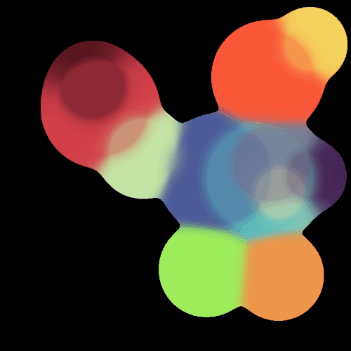

# Learn Taichi Lang
Taichi Lang &amp; LLVM learning

---

### Taichi Learning Phase 1

- Basic syntax and usage, being able to create some parallel visualized programs. Note that only one case will not be enough, therefore you can try to build more simple programs.
  - [x] SDF (DF) visualizer
  - [x] Marching squares
  - [x] Cellular automata (simple playable one)
  - [x] Flocking simulation (complex compared to the first three)

|           Distance Field visualization            |  SDF marching squares  | Cellular Automata  |
| :-----------------------------------------------: | :--------------------: | :----------------: |
|  |  |  |

- Related blog post for the first three small projects in Chinese: [Taichi-Learning-I](https://enigmatisms.github.io/2023/01/11/Taichi-Learning-I/)
- Flocking simulation blog post in Chinese: [Taichi-Learning-II](https://enigmatisms.github.io/2023/01/15/Taichi-Learning-II/)

https://user-images.githubusercontent.com/46109954/212971520-f7a906ea-6fe7-4cf1-a2c9-c4710bf527e4.mp4

### Taichi Learning Phase 2
- Implement a simple path tracer. The most important part is to fully understand Monte-Carlo integral used in path tracer. The files are included in `pti/`
  - [x] XML scene description parser
  - [x] Depth / direct lighting component rasterizer
  - [ ] BSDF only path tracer
  - [ ] Participating media
  
  

https://user-images.githubusercontent.com/46109954/214324298-d44ede93-0f14-4d88-9710-3590ed5faf29.mp4

