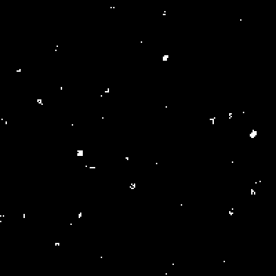

# Learn Taichi Lang
Taichi Lang & LLVM learning

---

### Taichi Learning Phase 1

- Basic syntax and usage, being able to create some parallel visualized programs. Note that only one case will not be enough, therefore you can try to build more simple programs.
  - [x] SDF (DF) visualizer
  - [x] Marching squares
  - [x] Cellular automata (simple playable one)
  - [x] Multi-body simulation

|           Distance Field visualization            |  SDF marching squares  | Cellular Automata  |
| :-----------------------------------------------: | :--------------------: | :----------------: |
|  |  |  |

​		Related blog post in Chinese: [Taichi-Learning-I](https://enigmatisms.github.io/2023/01/11/Taichi-Learning-I/)

- Take a look at some examples will be good, too. Get inspired by others.

